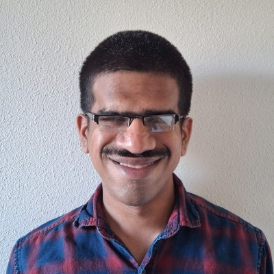

## About Me

I am an **Inclusive Researcher**. The strength in my research comes from my blindness, and through this I believe I can better empathize with people to make a meaningful change in the realm of accessible product design.
"Inclusive design" and "Accessibility" aren't just buzzwords or concepts used for compliance; they are necessary principles that ensure everyone has the opportunity to use a product, regardless of the abilities they possess.
I am creative, steadfast in my beliefs and strengths, a great problem solver, and also committed to my work.
I'm proficient in using assistive technologies like screen readers; NVDA, Narrator, VoiceOver, JAWS, TalkBack, Braille Displays,  text-to-speech software, and other accessibility products.
I am also adept at conducting qualitative research like User tests, interviews, and focus groups. I have always loved talking to people and understanding their stories, with this skill of mine, I believe I can conduct effective research to gain fruitful insights into a product.
I am also good at quantitative research like conducting surveys,  and analyzing the results to make a better product.

---

## Selected Projects

### Robotic Handover & User Needs Study
Conducted a detailed self-ethnography study followed by qualitative interviews with 13 participants to analyze user preferences, physical coordination, and spatial feedback methods during physical robotic interactions.

### Audio Guidance Systems for Robotics
Explored multi-modal feedback loops to assist users in operating robotic hardware, ensuring high compliance with digital and physical accessibility standards.

---

## Contact & Connections

Feel free to reach out or connect with me via the platforms below:

* **Email:** <your.email@example.com>
* **LinkedIn:** [Your LinkedIn Profile](https://linkedin.com)
* **GitHub:** [github.com/suhas-dharwad](https://github.com/suhas-dharwad)
